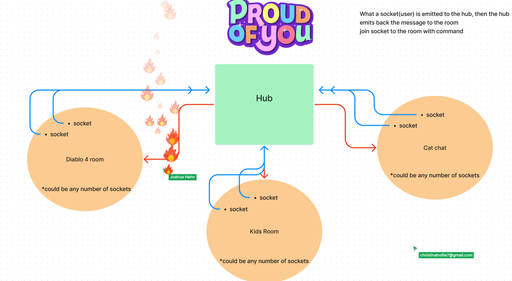

# CHATTER

This is a basic chat app server where people can join their favorite room to chat with others about all things pertaining to their favorite topic.

## UML

## User Stories

- As a user I want to be able to join a chat room to view the topics recent text thread.
- As a user I want to be able to leave a room to look for other interesting chat rooms.
- As a user I want to be able to contribute to the rooms text thread.